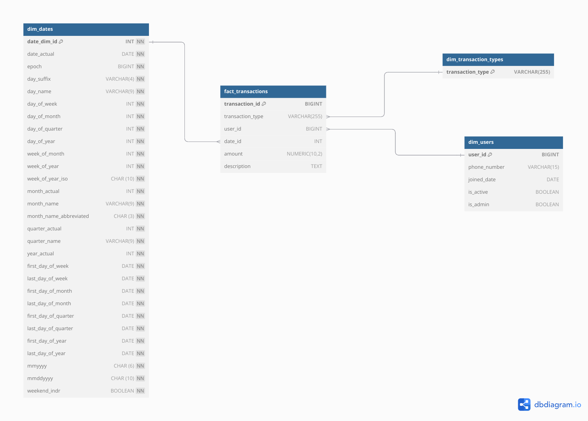

# Wallet-data ETL Pipeline

This project outlines an ETL (Extract, Transform, Load) pipeline for processing and storing transactional data in a data warehouse. The pipeline involves extracting data from multiple sources, transforming it into the required format, and loading it into a PostgreSQL data warehouse for analysis.

## Overview

The Data Warehouse consists of several tables to store transactional and user data in a structured format. These tables include dimension tables (for descriptive information) and fact tables (for transactional data).

### Key Components:

- **Fact Tables**: Store transactional data, including transactions and other events.
- **Dimension Tables**: Contain descriptive information related to the facts, such as users and dates.
- **ETL Pipeline**: Extracts data from various sources, transforms it (if necessary), and loads it into the data warehouse.

## Data Warehouse Schema

The data warehouse consists of the following tables:



### 1. `dim_users` (Dimension)

- Stores information about users, such as phone number, account status, and join date.
- **Columns**:
  - `user_id (BIGINT)`: Primary Key
  - `phone_number (VARCHAR(15))`: User's phone number
  - `joined_date (DATE)`: Date the user joined
  - `is_active (BOOLEAN)`: Indicates if the user is active
  - `is_admin (BOOLEAN)`: Indicates if the user is an admin

### 2. `dim_transaction_types` (Dimension)

- Stores types of transactions, ensuring no duplicate values.
- **Columns**:
  - `transaction_type (VARCHAR)`: Transaction type (e.g., Deposit, Withdrawal)

### 3. `dim_dates` (Dimension)

- Helper table to store various date-related information.
- **Columns**:
  - `date_dim_id (INT)`: Primary Key
  - `date_actual (DATE)`: The actual date
  - Various other columns related to the date (day, week, month, year)

### 4. `fact_transactions` (Fact)

- Stores transactional data with references to dimension tables (`dim_users`, `dim_transaction_types`).
- **Columns**:
  - `transaction_id (BIGINT)`: Primary Key
  - `user_id (BIGINT)`: Foreign Key (refers to `dim_users`)
  - `amount (FLOAT)`: Transaction amount
  - `transaction_type (VARCHAR)`: Foreign Key (refers to `dim_transaction_types`)
  - `created_at (TIMESTAMP)`: Timestamp of transaction

## ETL Pipeline

### Extract

- Data is pulled from different data sources like OLTP databases (user data, transactions), JSON, and CSV files.

### Transform

- Data is cleaned and transformed:
  - Missing or invalid values are handled.
  - Datetime columns are converted to string format for compatibility with the warehouse.
  - Negative balances and duplicates are removed.

### Load

- Data is loaded into the PostgreSQL Data Warehouse:
  - First, unique transaction types are inserted into the `dim_transaction_types` table.
  - Then, the `fact_transactions` table is populated with transaction data.

### Task Details:

- **Task 1**: `extract_oltp_data` - Extracts data from OLTP sources.
- **Task 2**: `extract_json_csv_data` - Extracts data from JSON and CSV files.
- **Task 3**: `transform_data` - Transforms the data by cleaning, merging, and converting.
- **Task 4**: `load_to_dw` - Loads the data into the PostgreSQL Data Warehouse.

## Running the Pipeline

1. **Install Dependencies**:

   - Ensure that you have Python 3.8+ and the required libraries installed.
   - Install dependencies using:
     ```bash
     pip install -r requirements.txt
     ```

2. **Set up Airflow**:

   - Make sure you have Apache Airflow set up in your environment. You can run Airflow locally or use Docker Compose.
   - Set up Airflow connections (`dw_db_conn`) for your PostgreSQL database in the Airflow UI.

3. **Start the DAG**:

   - Trigger the ETL pipeline DAG in Airflow, or let it run on a scheduled interval.

4. **Check Logs and Data**:
   - Monitor the logs for each task to ensure that the pipeline runs smoothly.
   - Validate the data in the data warehouse by querying the tables:
     ```sql
     SELECT * FROM fact_transactions;
     SELECT * FROM dim_users;
     ```

## Troubleshooting

- **Foreign Key Violations**: Ensure that the foreign keys in the `fact_transactions` table match the records in the respective dimension tables (e.g., `dim_users`, `dim_transaction_types`).
- **Date Formatting**: Ensure that all datetime columns are correctly formatted before inserting them into the warehouse.

## Technologies Used

- **Apache Airflow**: Orchestrates the ETL pipeline.
- **PostgreSQL**: Data warehouse database for storing processed data.
- **Python**: Programming language for data manipulation and task execution.

## Contributing

If you'd like to contribute to this project, feel free to fork it, create a branch, and submit a pull request. Any improvements, suggestions, or bug fixes are welcome!

## License

This project is licensed under the MIT License - see the [LICENSE](LICENSE) file for details.
